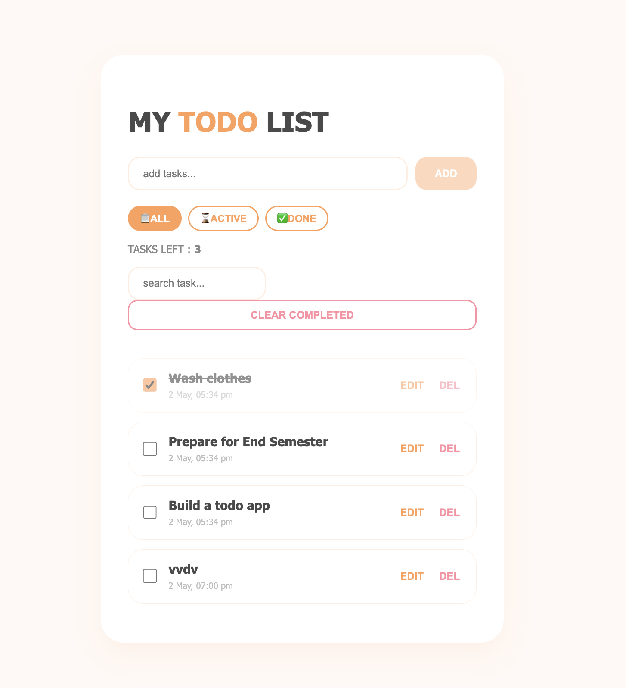

# My First Real React Project: A Todo List App

Hi there! Thanks for checking this out. This is my Todo List application built with React.

Building this was a huge milestone for me. As someone who is still learning and growing as a developer, this project helped me really get my hands dirty with how React actually manages state and user input. It's not just "another tutorial project"; I really pushed myself to make it look decent and act like a real app.

Here is a look at what the final version looks like:

## Why I Built This

Every beginner builds a todo list, but for this one, I wanted to go beyond just "Add" and "Delete." My goal was to make a complete tool that could handle real tasks and look polished enough that I'd actually use it.

This project was a major lesson in persistence. I learned a lot about:
*   Managing complex state (especially nested objects).
*   Handling user forms and keystrokes (like pressing "Enter" to save).
*   Making a clean UI without changing my original code structure just to fit a template.

## The Functionalities

I tried to pack in all the features that make a list actually usable. Here is what this app can do:

### 1. Task Essentials
*   **Adding Tasks:** You can type a task and hit the ADD button (or press Enter) to add it instantly.
*   **Persistent Storage:** This was huge! The app uses **Local Storage**. If you refresh the page or close your browser, your tasks are saved. It even comes with a few default tasks to get you started.
*   **Timestamps:** Every task gets a stamp showing exactly when it was created (e.g., "2 May, 05:34 pm").

### 2. Organizing & Cleaning
*   **Task Counter:** The app dynamically shows you exactly "TASKS LEFT" so you know what's still pending.
*   **Filtering:** You can quickly toggle between three views:
    *   📋 **ALL:** See everything.
    *   ⌛ **ACTIVE:** Just see the tasks that aren't done.
    *   ✅ **DONE:** Just see your completed tasks.
*   **Searching:** Just start typing in the search bar and the app filters your list instantly by checking the task description.
*   **Clear Completed:** A single button that instantly sweeps away all your finished tasks to declutter your list.

### 3. Making Changes
*   **Inline Editing:** Instead of opening a new menu, clicking EDIT lets you update your task right there in the list.
*   **Autofocus on Edit:** A neat quality-of-life feature—when you click Edit, the input field automatically focuses so you can just start typing.
*   **Checkbox/Toggle:** Clicking the checkbox marks the task complete, crossing it out and dimming it so you can focus on what's left.
*   **Deleting:** Of course, there's a DEL button if you need to wipe a single task completely.

## Final Thoughts

I know it’s just a todo list, but I’m quite proud of how this one turned out. Managing persistence and the search functionality together without breaking the editing workflow was tricky, but I learned a lot solving those bugs.

I’m looking forward to applying what I learned here to my next project. Thanks for reading!